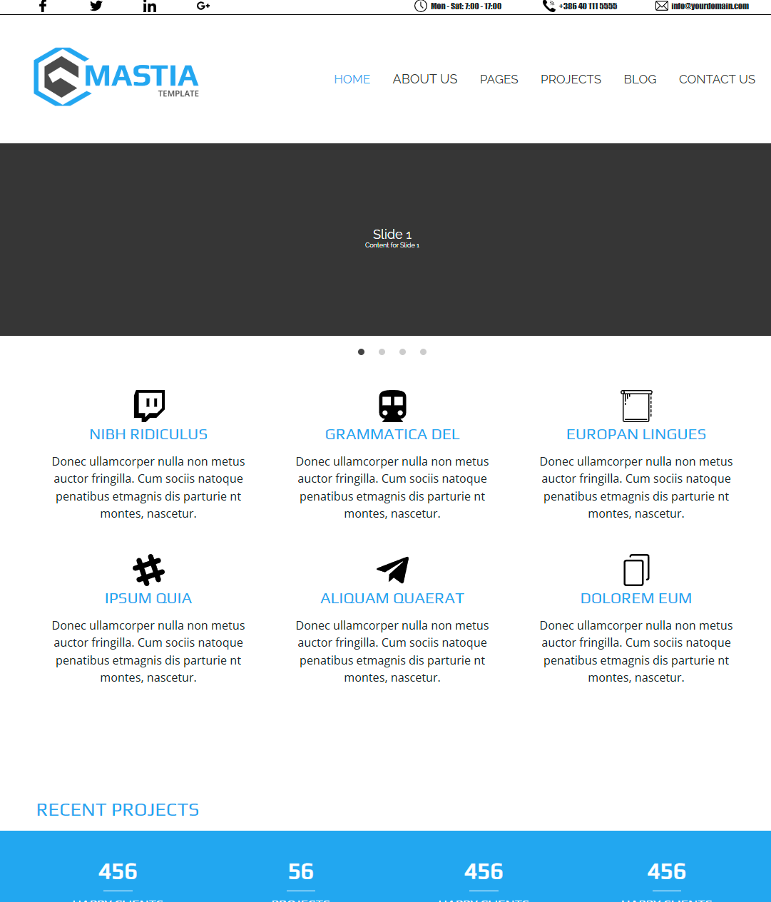

# First Multi-Page Website 2020

## Overview
This project is a multi-page website designed to demonstrate a simple, yet effective layout for a web application. It includes multiple pages such as Home, About, Services, and Contact.

## Site preview 

- [**Site link**](https://zloygolub.github.io/FirstMultiPageSite/)

## Features
- **Responsive Design**: The layout is fully responsive and works on all devices.
- **Navigation Bar**: A consistent navigation bar across all pages.
- **Footer**: A common footer with social media links.
- **Content Sections**: Each page contains distinct content sections.

## Pages
1. **Home**: Introduction and overview of the website.
2. **About**: Information about the website or organization.
3. **Services**: Details of the services offered.
4. **Contact**: Contact form and contact information.

## Technologies Used
- **HTML5**: For structuring the content.
- **CSS3**: For styling the website.
- **JavaScript**: For interactive elements.

## Setup
1. Clone the repository:
    ```bash
    git clone https://github.com/yourusername/FirstMultiPageSite.git
    ```
2. Navigate to the project directory:
    ```bash
    cd FirstMultiPageSite
    ```
3. Open `index.html` in your preferred web browser.

## Contributing
Contributions are welcome! Please fork the repository and create a pull request with your changes.

## License
This project is licensed under the MIT License.

## Contact
For any inquiries, please contact [kolosova.vell@gmail.com](mailto:kolosova.vell@gmail.com).
